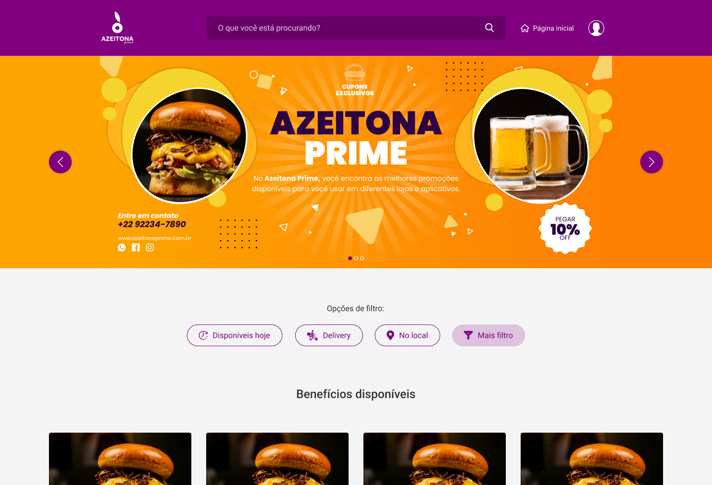

<h1 align="center">
  
</h1>

  <a href="#-tecnologias">Tecnologias</a>&nbsp;&nbsp;&nbsp;|&nbsp;&nbsp;&nbsp;
  <a href="#-projeto">Projeto</a>&nbsp;&nbsp;&nbsp;|&nbsp;&nbsp;&nbsp;
  <a href="#-layout">Layout</a>&nbsp;&nbsp;&nbsp;&nbsp;&nbsp;&nbsp;

 

  

## 🚀 Tecnologias

Projeto para praticar os conceitos de flexbox utilizando as tecnologias:

- HTML
- CSS
- JavaScript

## 💻 Projeto

Projeto criado para praticar os conceitos aprendidos de flexbox.

Site de vendas de cupons de desconto em estabelecimentos parceiros.

## 🔖 Layout

Link para acessar o site [Link do projeto](https://azeitonaprime-github-io.vercel.app/).
